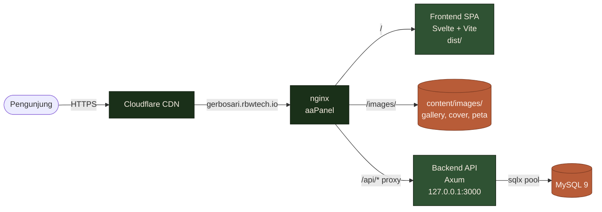
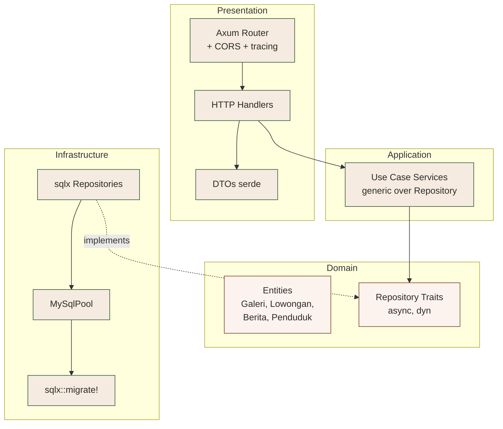
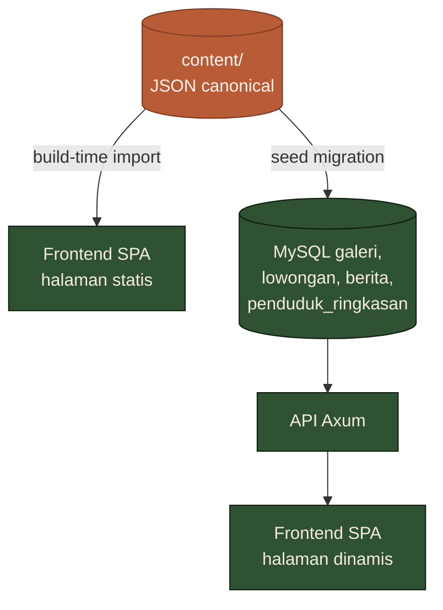
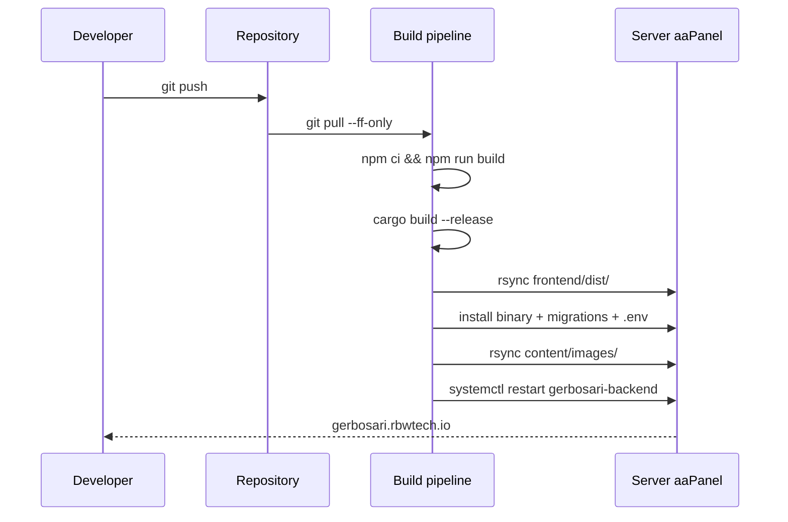

# Desa Gerbosari

Website profil resmi **Desa Gerbosari, Kecamatan Samigaluh, Kabupaten Kulon Progo, Daerah Istimewa Yogyakarta**.

Tayang di <https://gerbosari.rbwtech.io>.

## Daftar Isi

- [Ringkasan](#ringkasan)
- [Arsitektur](#arsitektur)
- [Tumpukan Teknologi](#tumpukan-teknologi)
- [Struktur Repository](#struktur-repository)
- [Pengembangan Lokal](#pengembangan-lokal)
- [Build Produksi](#build-produksi)
- [Deployment](#deployment)
- [Konvensi](#konvensi)
- [Roadmap](#roadmap)
- [Sumber Konten](#sumber-konten)

## Ringkasan

Situs ini menyajikan dua lapisan konten yang dideploy secara terpisah:

1. **Konten statis** — sejarah desa, visi & misi, struktur organisasi, dan peta wilayah. Sumbernya `content/pages/*.json`, dirakit ke dalam bundel SPA pada saat build.
2. **Konten dinamis** — galeri foto, ringkasan data penduduk per pedukuhan, lowongan kerja UMKM/lokal, serta berita & agenda kegiatan. Disajikan oleh REST API yang membaca MySQL.

Pendekatan dua-lapisan ini memungkinkan halaman profil dapat di-cache penuh oleh CDN sementara fitur dinamis tetap dapat diperbarui melalui kanal terpisah tanpa men-deploy ulang frontend.

## Arsitektur

### Topologi runtime



Frontend dan backend dibangun, di-versioning, dan dideploy secara independen — bukan satu monolit. nginx satu-satunya komponen yang tahu kedua-duanya.

### Clean Architecture backend



Panah dependensi mengarah ke dalam. `domain` tidak tahu apa-apa tentang Axum atau sqlx; `application` hanya bergantung pada trait di `domain`; implementasi konkrit dibatasi ke `infrastructure` dan `presentation`. Konsekuensinya: backend dapat di-test dengan repository mock dan ditukar database engine-nya tanpa menyentuh logika bisnis.

### Alur data konten



Folder `content/` adalah satu-satunya sumber kebenaran teks dan gambar desa. Frontend mengimpor JSON di waktu build; backend membaca seed yang setara di migration awal. Tidak ada duplikasi teks ke dalam source code mana pun.

## Tumpukan Teknologi

| Lapisan | Teknologi | Alasan |
|---|---|---|
| Frontend | Svelte 5 + Vite 8 + TypeScript + Tailwind 3 | SPA murni. Bundle akhir adalah folder `dist/` statis yang bisa disajikan oleh CDN atau nginx mana pun. |
| Router | Hash router buatan sendiri di `frontend/src/lib/router/` | Nol dependency pihak ketiga, kompatibel dengan host statis (tanpa URL rewrite di server). |
| Peta | Leaflet + OpenStreetMap | Tanpa kunci API dan tanpa kuota. |
| Backend | Rust stable + Axum 0.7 + sqlx 0.8 (mysql, tokio-rustls) + tokio | Async penuh. Empat lapisan clean architecture: `domain → application → infrastructure → presentation`. |
| Database | MySQL 9 | Dikelola oleh aaPanel pada host yang sama. |
| Web server | nginx (vhost dikelola aaPanel) | Reverse proxy `/api/*`, alias `/images/`, dan menyajikan SPA. |
| Layanan | systemd | Unit `gerbosari-backend.service` menjalankan binary `release` sebagai user `www`. |

Palet warna sengaja tidak generik: `menoreh` (hijau-teal hutan), `terakota` (merah batik hangat), `krem` (krem kertas), `tanah` (umber untuk seksi sejarah), `arang` (slate hangat untuk teks). Tipografi: Lora serif untuk sejarah & legenda, Inter untuk antarmuka.

## Struktur Repository

```
.
├── content/                    Sumber kebenaran konten desa
│   ├── pages/*.json            sejarah, visi-misi, struktur-organisasi, peta-wilayah, beranda
│   ├── seed/*.json             galeri, lowongan, berita, penduduk-ringkasan
│   └── images/                 cover/, gallery/, peta/
│
├── frontend/                   Svelte 5 SPA — di-deploy ke webroot
│   └── src/
│       ├── lib/api/            klien backend (typed fetch wrappers)
│       ├── lib/components/     layout + primitif UI (Stat, Chip, Tabs, ...)
│       ├── lib/content/        loader konten statis (impor JSON saat build)
│       ├── lib/types/          DTO interface yang mencerminkan respons backend
│       └── routes/             satu file Svelte per route, berbasis hash
│
├── backend/                    Rust + Axum + sqlx — di-deploy ke _backend/
│   ├── migrations/             file SQL diterapkan saat startup via sqlx::migrate!
│   └── src/
│       ├── domain/             entitas + repository trait (murni, tanpa I/O)
│       ├── application/        use case (service generik atas trait repo)
│       ├── infrastructure/     implementasi repository sqlx + pool koneksi
│       └── presentation/       router Axum, handler, DTO (serde)
│
└── deploy/                     artefak produksi (lihat deploy/README.md)
```

## Pengembangan Lokal

Prasyarat: Node 20+, Rust stable, MySQL 9.

### Backend

```bash
cd backend
cp .env.example .env
mysql -uroot -p -e "CREATE DATABASE gerbosari CHARACTER SET utf8mb4 COLLATE utf8mb4_unicode_ci;"
cargo run
```

Migrations otomatis dijalankan saat startup. Server mendengarkan di `0.0.0.0:3000` (konfigurasi via `BIND_ADDR` di `.env`).

### Frontend

```bash
cd frontend
cp .env.example .env.local
npm install
npm run dev
```

Buka <http://localhost:5173>. Sembilan rute terpasang: `/`, `/sejarah`, `/visi-misi`, `/struktur-organisasi`, `/peta-wilayah`, `/galeri`, `/data-penduduk`, `/lowongan`, `/berita`, `/berita/:slug`.

## Build Produksi

Kedua lapisan menghasilkan artefak independen.

```bash
# Frontend → ./frontend/dist/   (index.html, assets/, favicon.svg)
cd frontend && npm ci && npm run build

# Backend → ./backend/target/release/gerbosari-backend
cd backend && cargo build --release
```

Vite membaca `frontend/.env.production` saat build, yang menetapkan `VITE_API_BASE=/api` sehingga SPA berbagi origin dengan API di belakang nginx.

## Deployment

Host produksi menjalankan aaPanel; webroot di `/www/wwwroot/gerbosari.rbwtech.io/`. Runbook lengkap di [`deploy/aapanel-setup.md`](deploy/aapanel-setup.md).

Tata letak akhir di server:

```
/www/wwwroot/gerbosari.rbwtech.io/
├── index.html, assets/, favicon.svg     frontend dist (publik)
├── content/images/                      nginx alias /images/ -> sini
└── _backend/                            location ^~ /_backend/ deny all
    ├── gerbosari-backend                ExecStart systemd
    ├── migrations/                      file SQL terbundel
    └── .env                             mode 0600, owner www
```

Migrations dibundel ke binary lewat `sqlx::migrate!("./migrations")` dan diterapkan otomatis saat backend startup — tidak ada langkah `sqlx-cli migrate run` manual dalam alur deploy.



## Konvensi

- Konten dan teks antarmuka dalam Bahasa Indonesia. Identifier kode, komentar, dan pesan commit tetap dalam Bahasa Inggris.
- Tidak ada emoji dalam UI. Gunakan SVG inline (gaya stroke Lucide) atau berkas `<svg>`. Diaudit dengan `grep` setelah setiap perubahan signifikan.
- Field name API dalam `snake_case` agar mencerminkan output serde Rust apa adanya. `frontend/src/lib/types/index.ts` adalah dokumen kontrak — diubah hanya bersamaan dengan `backend/src/presentation/dto/*.rs`.
- Card tanpa drop shadow secara default. Hanya border 1 px dan kontras background. Tidak ada glassmorphism dan tidak ada animasi gradient (kecuali overlay alpha pada hero).
- Migration bersifat append-only — gunakan migration baru untuk perubahan skema, jangan edit migration yang sudah dipublikasikan.

## Roadmap

- **UI admin CRUD.** Backend saat ini hanya membuka endpoint read. Method write sudah tersedia di trait `domain::repository`, tinggal dihubungkan ke handler. Langkah berikutnya: route `/admin` di SPA dengan POST/PATCH/DELETE yang diproteksi JWT.
- **Koordinat per pedukuhan.** Peta saat ini memakai layout cincin deterministik di sekitar kantor desa. Akan diganti dengan lat/lon hasil survei lapangan.
- **Pipeline optimasi gambar.** Aset gambar masih ukuran asli dari sumber. Penambahan `vite-plugin-imagetools` untuk varian `.webp` + `srcset` akan menurunkan LCP secara signifikan.
- **OpenTelemetry.** `tracing` sudah terpasang di backend; tinggal menambah exporter OTLP ke collector untuk menutup loop observabilitas.

## Sumber Konten

- Buku Profil Desa Gerbosari (Devi & Hidayati, 2020).
- Situs resmi <https://gerbosari-kulonprogo.desa.id>.
- Wikipedia (entri Gerbosari, Samigaluh, dan Kulon Progo).

Atribusi sumber disimpan di setiap berkas konten yang relevan di dalam `content/`.
